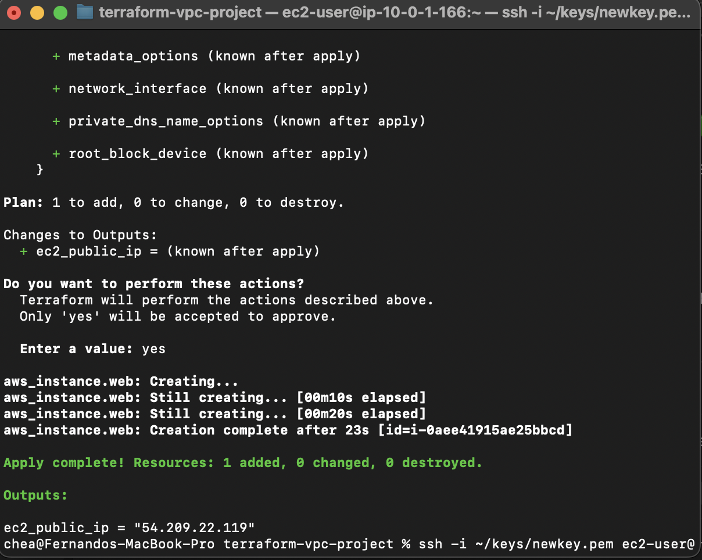
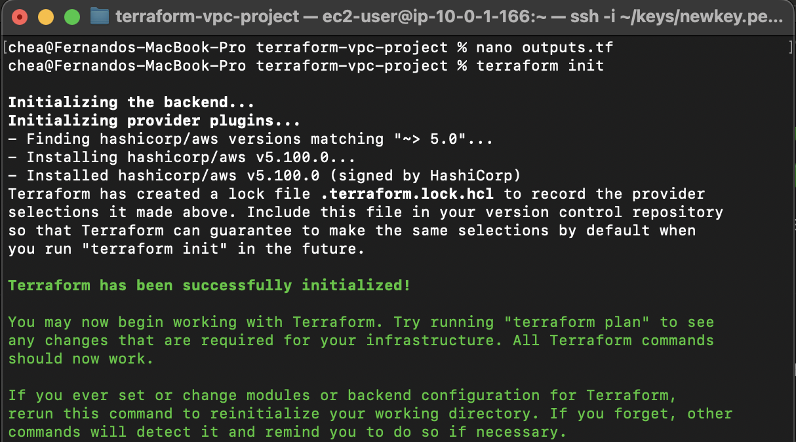
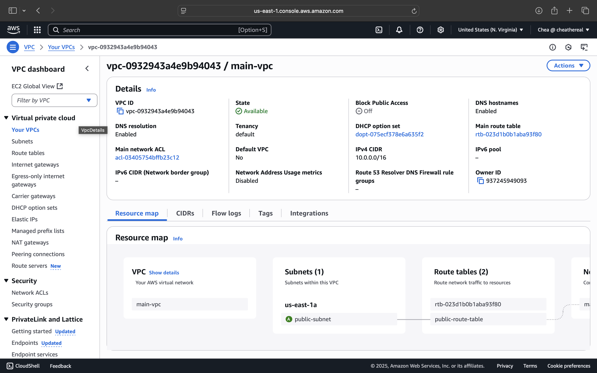
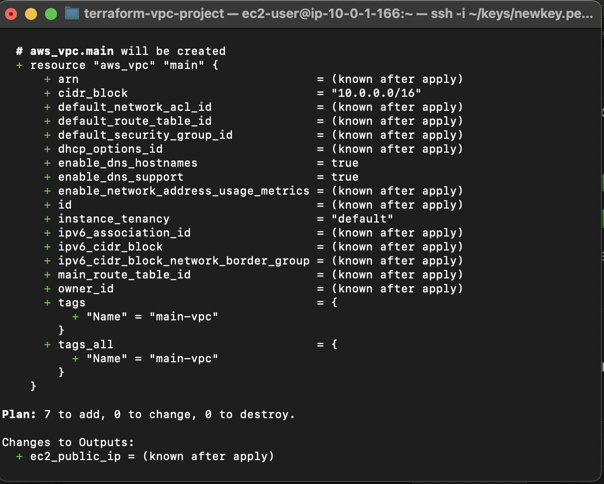

# 🛠️ Terraform VPC + EC2 Automation Project

This project uses **Terraform** to automate deployment of a complete, production-style AWS environment. It builds a custom VPC from scratch and deploys a public EC2 instance — all defined in code, with no manual setup required.

---

## 🚀 What It Builds

- 🧱 **Custom VPC** with CIDR block `10.0.0.0/16`
- 🌐 **Public Subnet** with Internet Gateway and Route Table
- 🔐 **Security Group** allowing SSH (22) and HTTP (80)
- 💻 **EC2 Instance** (Amazon Linux 2023, `t2.micro`)
- 🧠 **Terraform Variables + Outputs** for modularity and reusability

---

## 🖼️ Screenshots

| EC2 Output from Terraform | AWS Console (EC2) |
|---------------------------|-------------------|
|  |  |

| VPC and Network Setup | SSH into EC2 |
|-----------------------|---------------|
|  |  |

---

## 📂 Project Structure

terraform-vpc-project/
├── main.tf # All AWS resources (VPC, Subnet, EC2, SG, etc.)
├── variables.tf # Input variables
├── terraform.tfvars # Variable values (e.g., key name, region)
├── outputs.tf # Prints public IP after apply
├── .gitignore # Prevents committing sensitive files
├── README.md # You're reading it!
└── screenshots/ # Deployment proof


---

## ⚙️ How to Use

1. Clone the repo:
   ```bash
   git clone https://github.com/CheaTheReal/terraform-vpc-project.git
   cd terraform-vpc-project

---

## ⚙️ How to Use

1. Clone the repo:
   ```bash
   git clone https://github.com/CheaTheReal/terraform-vpc-project.git
   cd terraform-vpc-project
2. Edit terraform.tfvars with your AWS key name and region
3. Deploy infrastructure:terraform init
                         terraform apply
4. Connect to your instance:ssh -i ~/keys/your-key.pem ec2-user@<public_ip>
5. Destroy resources to stay within free tier:terraform destroy


✅ Skills Demonstrated

Infrastructure as Code (IaC) using Terraform
AWS Networking: VPC, subnets, route tables, IGW
EC2 provisioning and secure access (key pair + security group)
Modular, scalable Terraform with variables and outputs
Cost management: automated teardown for free-tier usage
🔗 Live Project Link

👉 View on GitHub

🙌 Author

Fernando Perez
AWS Certified Cloud Practitioner
Aspiring Cloud/DevOps Engineer
📫 github.com/CheaTheReal


